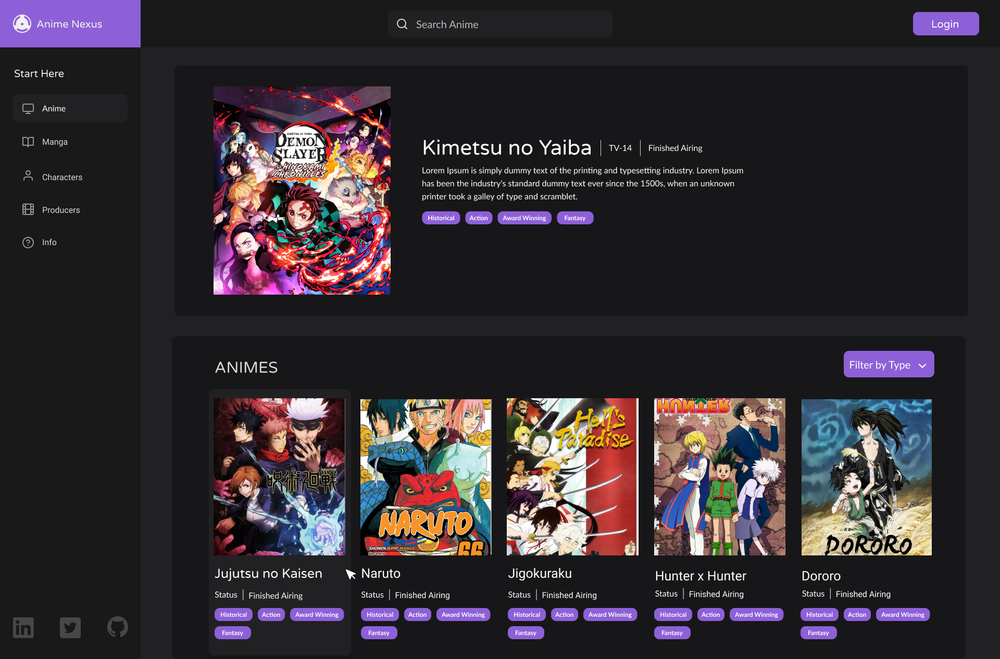

# Anime Nexus



#### Access here (still updating) -> [Anime-Nexus](https://matheusleite01.github.io/Weather-app-React/)
<br>

# Overview

Anime nexus is a web app built with React that allows users to search different animes and find out information about them. The application fetches data from the [Jikan API](https://jikan.moe), providing various information such as episodes, popularity, season and more.

The project incorporates a responsive design, ensuring a seamless user experience across various devices. The initial design was created using Figma, a popular design tool, to ensure an aesthetically pleasing and intuitive user interface.

# Technologies Used

- React: JavaScript library for building user interfaces.
- [Jikan API](https://jikan.moe): Data source for anime information.
- Figma: Design tool used to create the application layout.

<br>


# Design
- [Anime Nexus](https://www.figma.com/file/IRzrCf252FSzet76iMBAB0/AnimeNexus?type=design&node-id=27%3A167&mode=design&t=1hMXvU5f9JnTg7he-1)
 

<br>

# How to Run the Project

Run the following command on your local environment:
1. Clone this repository.

```
git clone https://github.com/matheusleite01/Anime-Nexus.git
```
2. Install project dependencies by running the command:
``` 
npm install
``` 
3. Run the project with this command:
``` 
npm run dev
``` 

<br>

# Next Steps

- Improve the layout and user experience.
- Add extra features, such as extended forecast, dynamic weather icons, etc.
- Implement automated testing.
- Refactor the code to follow best practices and development standards.

Feel free to contribute with improvements, bug fixes, or suggestions. I hope this project serves as a useful learning opportunity in React!

<br>

# License

Licensed under the MIT License, Copyright © 2023

See [LICENSE](https://github.com/matheusleite01/Weather-app-React/blob/master/LICENSE) for more information.
